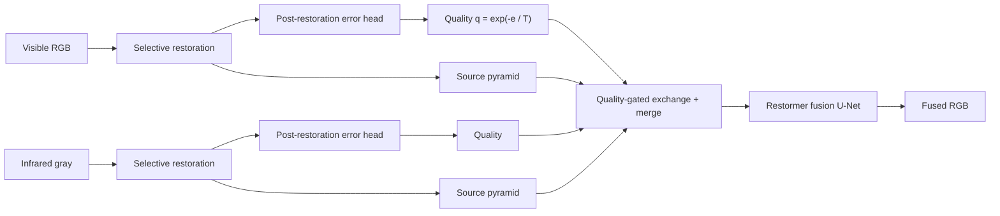

# ReQFuse — Robust Infrared and Visible Image Fusion

**Selective restoration and post-restoration quality-guided fusion for degraded infrared–visible pairs (PyTorch).**

ReQFuse restores each modality first, estimates how much residual error remains
after restoration, and uses that quality signal to control both source features
and cross-modal messages inside a Restormer-style fusion network. The network is
trained end-to-end against synthetic degradation, so a single model handles
rain, snow, haze, noise, blur, low light, infrared striping and low contrast
without per-condition fine-tuning.


## Method overview



Two modules carry the method ([model/restoration.py](model/restoration.py),
[model/quality.py](model/quality.py)):

- **Selective restoration.** Per modality, a three-level Restormer U-Net
  predicts a *modification demand* and a bounded residual;
  `restored = input + applied_demand × residual`. The demand gate is detached
  from reconstruction gradients, so restoration/fusion cannot lower their loss
  by closing it — only the auxiliary supervision moves it.
- **Post-restoration quality control.** An error head regresses the normalized
  residual error `u` on detached inputs, mapped to `e = 0.1 · ReLU(u)` and
  quality `q = exp(−e / 0.1)`. Quality gates the source K/V of local-window
  channel cross-attention (bidirectional, at fusion scales 2–3) and the
  per-scale feature merge, before a four-level fusion U-Net produces the RGB
  output.

Implementation version `restormer_v2`, **8,725,358 parameters**. Degradation
masks supervise training only; **inference takes only a registered VI/IR pair**.

## Results

All results below come from the **MSRS test set with synthetic degradations**
(generated by [generate_degradation.py](generate_degradation.py), severity
**level 2 / medium**), fused by the single released recipe — no per-condition
tuning. Figures show scene `00123D`; four curated scenes per condition are in
`results/` after running `test.py`.

**Visible-image degradations** (degraded visible + clean infrared input → fused):


**Infrared-image degradations** (clean visible + degraded infrared input → fused):


## Degradation protocol

Nine operators, shared by online training degradation
([utils/degradation.py](utils/degradation.py)) and the offline, fingerprinted
generator ([utils/synthetic_degradation.py](utils/synthetic_degradation.py)).
Each affected modality receives exactly one operator.

**Online training pool:** clean / VI-only / IR-only / both-modality cases are
sampled with probabilities **0.2 / 0.3 / 0.3 / 0.2**; a drawn degradation is
**local (soft, ≈40% area) with probability 0.7**, global otherwise; severity is
drawn **light / medium / heavy = 0.25 / 0.5 / 0.25**. Training patches reserve a
16-pixel context margin so local regions stay consistent after cropping.

**Severity table** (noise σ in 8-bit units; levels 1–3 = light / medium / heavy):

| Operator | Modality | Light | Medium | Heavy |
|---|---|---|---|---|
| Gaussian + Poisson noise | VI & IR | σ=5, peak=120 | σ=10, peak=80 | σ=20, peak=50 |
| Gaussian blur | VI | 21×21, σ=1.2 | 21×21, σ=2.0 | 21×21, σ=2.6 |
| Low light | VI | γ=1.5 | γ=2.0 | γ=3.0 |
| Rain | VI | 2% coverage, α=0.15 | 5%, α=0.30 | 8%, α=0.45 |
| Snow | VI | 3% coverage, α=0.50 | 6%, α=0.70 | 10%, α=0.85 |
| Haze | VI | β=0.5 | β=1.0 | β=2.0 |
| Stripe (column-correlated) | IR | σ=3 | σ=6 | σ=10 |
| Low contrast | IR | α=0.8 | α=0.5 | α=0.3 |

Implementation notes: low light attenuates a smooth max-RGB illumination
estimate in Retinex form and couples shot/read noise in linear RGB; rain/snow
are procedurally composited sprites with *measured* in-region coverage (rain
streaks 12–30 px long, ±20°; snow flakes radius 1–6); haze uses airlight 0.75
and a distance cap of 0.7, optionally driven by a depth map; low contrast
rescales around the original mean. Severity presets are fixed in code — the
same table governs both training and test-set generation. Degradation forms and
several parameters follow DSPFusion / ControlFusion task setups; the three-level
protocol and weather compositing are this project's choices.

## Installation

Python 3.10+; a CUDA GPU is recommended (CPU and Apple MPS also work).

```bash
git clone git@github.com:kunzhou357/ReQFuse.git
cd ReQFuse
pip install -r requirements.txt
```

## Usage

All three entry points follow the same convention: **edit the `EDIT HERE`
block at the top of the file, then run it without arguments** (any CLI argument
aborts).

### Training — `train.py`

Two stages: `RESTORATION_EPOCHS` restoration-only epochs, then `FUSION_EPOCHS`
joint epochs (fusion loss ramps in over `transition_epochs`). Default recipe:
128×128 crops, batch 4 × 2 accumulation, AdamW 2e-4 with per-stage warmup +
cosine decay. `ONLINE_DEGRADATION=True` (default) reads HQ originals and
applies the online pool on the fly; `False` consumes pre-degraded pairs from
`generate_degradation.py` via the `HQ_*_DIR` directories. Writes
`OUTPUT_DIR/latest.pth` every epoch plus `epoch_XXX.pth` every 10 epochs;
`RESUME_TRAINING=True` restores and verifies the recipe, data fingerprint and
RNG state exactly.

### Inference — `test.py`

Loads `CHECKPOINT_PATH`, fuses every registered pair under
`VISIBLE_DIR`/`INFRARED_DIR`, writes RGB and grayscale PNGs to
`OUTPUT_DIR/rgb` and `OUTPUT_DIR/gray`.

### Offline degradation — `generate_degradation.py`

Freezes the shared operators into reproducible paired datasets: degraded
VI/IR, supervision masks, soft envelopes, previews and a per-sample
`records.csv`; each output directory records a `run_info.json` fingerprint and
regeneration with different settings/sources is refused. Haze can optionally
use a depth-map directory for spatially varying transmission.

## Data conventions

- VI/IR datasets are strictly paired by relative filename stem (recursive) and
  must be registered; loaders validate and report mismatches. VI is RGB, IR is
  grayscale, floats in [0, 1].
- Training defaults: `data/train_MSRS/vis` and `data/train_MSRS/ir`.
- MSRS test tree (used for the results above): clean modalities at
  `data/test_MSRS/vi` and `data/test_MSRS/ir`; per-condition inputs at
  `data/test_MSRS/<condition>/<level 1-3>/` (e.g. `vi_rain/2/vi`,
  `ir_stripe/3/ir`).
- Paired training mode auto-discovers `mask_vi`/`mask_ir` sibling directories.

## Repository layout

```
train.py                   two-stage training entry point
test.py                    fusion inference entry point
generate_degradation.py    offline paired-degradation generator
model/                     network (fusion net, restorers, quality exchange, blocks)
utils/                     data, degradation operators, losses, experiment utilities
assets/                    README figures
```

Checkpoints are self-describing (model config, optimizer, RNG state, training
signature) and always loaded `strict=True`; incompatible versions fail loudly.
Datasets and model weights are not distributed with this repository — prepare
them locally with the scripts above.

## References

- [Restormer](https://github.com/swz30/Restormer) — MDTA/GDFN blocks and restoration backbones.
- [DSPFusion](https://github.com/Linfeng-Tang/DSPFusion) — multi-scale fusion design and degradation tasks.
- [ControlFusion](https://github.com/Linfeng-Tang/ControlFusion) — degradation forms and parameters.
- [AMG-Fuse](https://github.com/ixilai/AMG-Fuse) — modality/fusion role organization.

ReQFuse is an independent implementation, not an official reproduction of the above.

## License

MIT — see [LICENSE](LICENSE). MSRS is a public dataset; follow its own terms
for the data.
