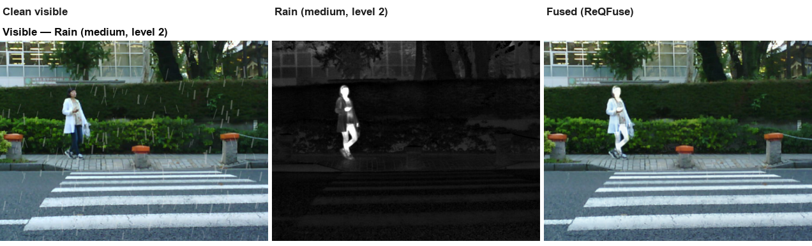
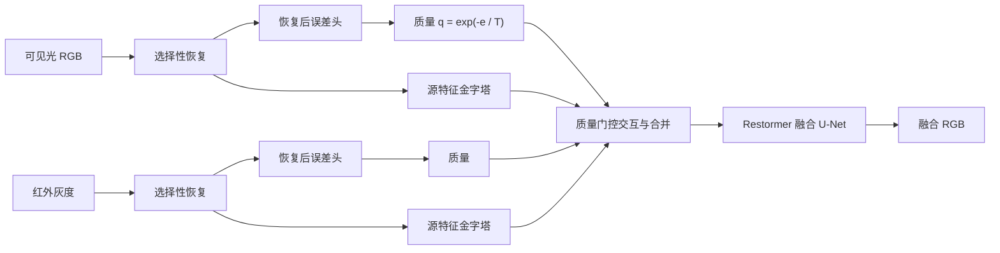
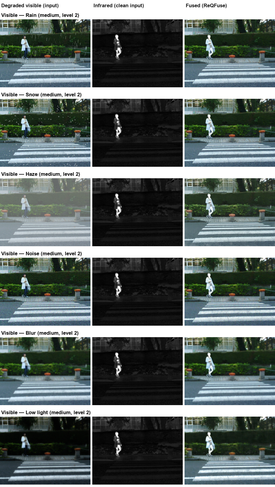
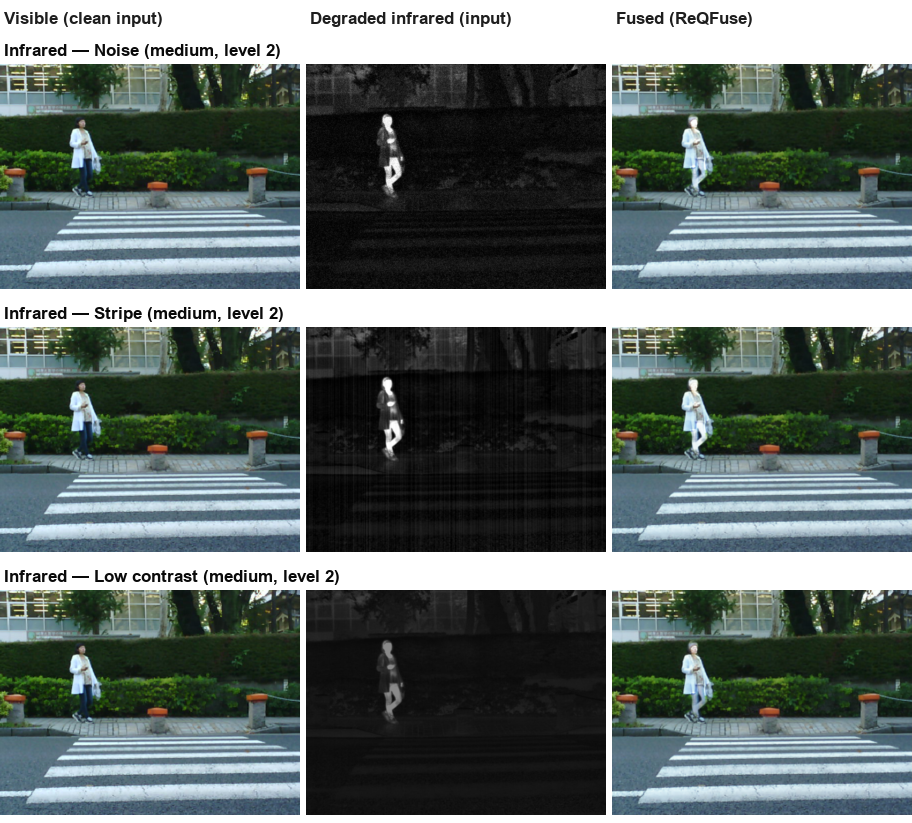

# ReQFuse —— 鲁棒红外与可见光图像融合

**面向退化输入的选择性恢复与恢复后质量引导融合（PyTorch）。**

ReQFuse 先在各自模态内恢复图像，再估计恢复后的残留误差，用该质量信号同时控制源特征与跨模态消息，
最后由 Restormer 风格的融合网络输出融合结果。网络针对合成退化端到端训练，
单一模型即可应对雨、雪、雾、噪声、模糊、低光照、红外条纹与低对比度，无需按条件微调。



## 方法概览



方法由两个模块承担（[model/restoration.py](model/restoration.py)、
[model/quality.py](model/quality.py)）：

- **选择性恢复。** 每路模态由三层 Restormer U-Net 预测*修改需求*与有界残差，
  `restored = input + applied_demand × residual`。需求门对重建梯度 detach，
  恢复/融合无法通过关闭该门降低损失——只有辅助监督能移动它。
- **恢复后质量控制。** 误差头在 detach 输入上回归归一化残差 `u`，
  映射为 `e = 0.1 · ReLU(u)` 与质量 `q = exp(−e / 0.1)`。质量门控局部窗口通道
  交叉注意力的源 K/V（双向，融合第 2–3 尺度）与逐尺度特征合并，最后由四层融合
  U-Net 输出 RGB。

实现版本 `restormer_v2`，参数量 **8,725,358**。退化掩码仅用于训练监督；
**推理只输入配准好的 VI/IR 图像对**。

## 融合结果

以下结果全部来自 **MSRS 测试集 + 人工合成退化**（由
[generate_degradation.py](generate_degradation.py) 生成，强度为 **level 2 / 中等**），
由同一份训练配方融合——未做任何按条件微调。图中场景为 `00123D`；
每个条件完整挑出的 4 个场景在运行 `test.py` 后位于 `results/`。

**可见光退化**（退化可见光 + 干净红外输入 → 融合）：



**红外退化**（干净可见光 + 退化红外输入 → 融合）：



## 退化协议

九种算子，在线训练退化（[utils/degradation.py](utils/degradation.py)）与离线指纹化
生成器（[utils/synthetic_degradation.py](utils/synthetic_degradation.py)）共用同一实现。
每个受影响的模态恰好施加一种算子。

**在线训练退化池：** 干净 / 仅 VI / 仅 IR / 双模态四种情形按概率
**0.2 / 0.3 / 0.3 / 0.2** 采样；抽中的退化以 **0.7 概率局部作用**（软区域，约 40% 面积），
否则全图；强度按 **轻 / 中 / 重 = 0.25 / 0.5 / 0.25** 抽取。训练裁剪保留 16 像素上下文
边距，保证局部区域裁剪后仍然一致。

**强度表**（噪声 σ 为 8-bit 单位；级别 1–3 = 轻 / 中 / 重）：

| 算子 | 模态 | 轻 | 中 | 重 |
|---|---|---|---|---|
| 高斯 + 泊松噪声 | VI 与 IR | σ=5, peak=120 | σ=10, peak=80 | σ=20, peak=50 |
| 高斯模糊 | VI | 21×21, σ=1.2 | 21×21, σ=2.0 | 21×21, σ=2.6 |
| 低光照 | VI | γ=1.5 | γ=2.0 | γ=3.0 |
| 雨 | VI | 覆盖 2%, α=0.15 | 5%, α=0.30 | 8%, α=0.45 |
| 雪 | VI | 覆盖 3%, α=0.50 | 6%, α=0.70 | 10%, α=0.85 |
| 雾 | VI | β=0.5 | β=1.0 | β=2.0 |
| 条纹（列相关） | IR | σ=3 | σ=6 | σ=10 |
| 低对比度 | IR | α=0.8 | α=0.5 | α=0.3 |

实现说明：低光照以平滑 max-RGB 估计照明、按 Retinex 形式衰减，并在线性 RGB 域耦合
shot/read 噪声；雨/雪为程序化精灵合成，按区域**实测覆盖率**控制（雨丝长 12–30 px、
±20°；雪花半径 1–6）；雾的空气光为 0.75、距离上限 0.7，可选由深度图驱动透射率；
低对比度围绕原均值缩放。强度预设固定在代码中——训练与测试集生成共用同一张表。
退化形式与部分参数参考 DSPFusion / ControlFusion 的任务设置；三级协议与天气合成方式
为本项目的选择。

## 安装

Python 3.10+；推荐 CUDA GPU（CPU 与 Apple MPS 亦可）。

```bash
git clone git@github.com:kunzhou357/ReQFuse.git
cd ReQFuse
pip install -r requirements.txt
```

## 用法

三个入口脚本遵循同一约定：**编辑文件顶部的 `EDIT HERE` 配置块，然后无参数运行**
（传入任何命令行参数都会中止）。

### 训练 —— `train.py`

两个阶段：`RESTORATION_EPOCHS` 个仅恢复轮次，随后 `FUSION_EPOCHS` 个联合轮次
（融合损失在 `transition_epochs` 内线性引入）。默认配方：128×128 裁剪、batch 4 ×
梯度累积 2、AdamW 2e-4、逐阶段 warmup + 余弦衰减。`ONLINE_DEGRADATION=True`（默认）
直接读取 HQ 原图并在线施加退化池；`False` 时通过 `HQ_*_DIR` 使用
`generate_degradation.py` 预生成的配对数据。每轮写 `OUTPUT_DIR/latest.pth`，
每 10 轮额外保存 `epoch_XXX.pth`；`RESUME_TRAINING=True` 续训时严格校验并恢复
配方、数据指纹与随机状态。

### 推理 —— `test.py`

加载 `CHECKPOINT_PATH`，融合 `VISIBLE_DIR`/`INFRARED_DIR` 下所有配准图像对，
输出 RGB 与灰度 PNG 到 `OUTPUT_DIR/rgb` 和 `OUTPUT_DIR/gray`。

### 离线退化 —— `generate_degradation.py`

将共享算子固化为可复现的配对数据集：退化 VI/IR、监督掩码、软包络、预览图与逐样本
`records.csv`；每个输出目录记录 `run_info.json` 指纹，设置或数据源不同的重复生成会被
拒绝。雾退化可选使用深度图目录生成空间变化的透射率。

## 数据约定

- VI/IR 数据集按相对文件名主干严格配对（递归索引）且必须配准；加载器会校验并列出不匹配项。
  VI 为 RGB，IR 为灰度，浮点范围 [0, 1]。
- 训练默认目录：`data/train_MSRS/vis` 与 `data/train_MSRS/ir`。
- MSRS 测试目录（上方结果即来自此）：干净模态位于 `data/test_MSRS/vi` 与
  `data/test_MSRS/ir`；按条件输入位于 `data/test_MSRS/<condition>/<level 1-3>/`
  （如 `vi_rain/2/vi`、`ir_stripe/3/ir`）。
- 配对训练模式自动发现可见光/红外目录的同级 `mask_vi`/`mask_ir` 目录。

## 仓库结构

```
train.py                   两阶段训练入口
test.py                    融合推理入口
generate_degradation.py    离线配对退化生成器
model/                     网络（融合网络、恢复器、质量交换、基础模块）
utils/                     数据、退化算子、损失、实验工具
assets/                    README 配图
```

检查点自描述（模型配置、优化器、随机状态、训练签名），且始终以 `strict=True` 加载；
不兼容版本会显式报错。数据集与模型权重不随仓库分发——请用上述脚本在本地准备。

## 参考

- [Restormer](https://github.com/swz30/Restormer) —— MDTA/GDFN 模块与恢复主干。
- [DSPFusion](https://github.com/Linfeng-Tang/DSPFusion) —— 多尺度融合设计与退化任务。
- [ControlFusion](https://github.com/Linfeng-Tang/ControlFusion) —— 退化形式与参数。
- [AMG-Fuse](https://github.com/ixilai/AMG-Fuse) —— 模态/融合职责组织。

ReQFuse 为独立实现，并非上述项目的官方复现。

## 许可证

MIT —— 见 [LICENSE](LICENSE)。MSRS 为公开数据集，数据使用请遵循其自身条款。
